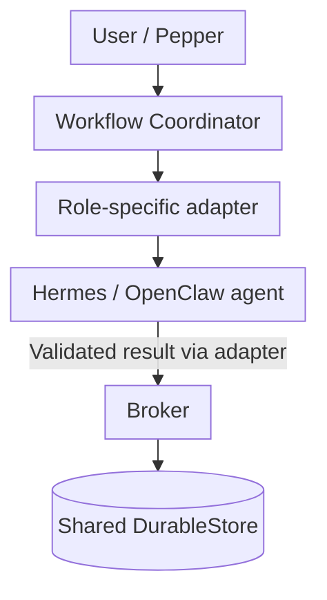

# AI Workforce

An evidence-driven personal AI workforce that coordinates specialized agents through durable workflows while keeping authorization, data handling, and external actions under deterministic control.

> **Portfolio showcase.** The production repository is private because it contains personal workflows, local deployment configuration, and operational artifacts. This repository contains newly written documentation, aggregate validation results, and a standalone synthetic example—no credentials, private prompts, personal data, or production source.

## Why I built it

General-purpose assistants are useful, but sustained knowledge work needs more than a chat loop. Research must remain traceable, handoffs must survive process failure, private context must stay bounded, and an agent must never silently turn a suggestion into an external action.

AI Workforce explores that problem for an individual knowledge worker through four operational roles:

| Agent | Responsibility | Harness |
| --- | --- | --- |
| **Pepper** | Chief of staff, request routing, and workflow coordination | Hermes |
| **Kent** | Public research, source provenance, and claim/evidence analysis | OpenClaw |
| **Lex** | Evidence-bound long-form editorial drafting | Hermes |
| **SpongeBob** | Career research, fit analysis, and draft preparation | Hermes |

A fifth social-intelligence role, **Skippy**, is intentionally deferred until its external platform boundary can be proven safely.

## Architecture at a glance



The coordinator dispatches through role-specific adapters and shares the Broker's `DurableStore`. The Broker validates and authorizes artifact commitment, lineage, and replay; it is not the general agent transport. Persisted cross-agent artifacts and workflow effects remain subordinate to deterministic Broker checks. Interactive harness chat responses do not universally pass through the Broker.

Each authorized Hermes/OpenClaw profile connects separately to a **Second-brain MCP boundary**, which enforces agent identity and vault partitions. Selected reviewed adapters govern external actions through deterministic policy and explicit human approval; unsupported connectors and consequential external writes remain denied.

[Read the architecture](docs/architecture.md) · [Follow a workflow](docs/walkthrough.md) · [Review validation evidence](docs/validation.md)

## Engineering highlights

- **Durable coordination beside the Broker.** A dedicated coordinator shares the Broker's authoritative store and implements leases, event history, dispatch records, cancellation, and recovery.
- **At-least-once, idempotent effects.** Ambiguous agent outcomes are reconciled against committed artifacts before retry, avoiding false “exactly once” claims.
- **Typed, minimized handoffs.** Cross-agent artifacts carry schemas, provenance, content hashes, data classes, and purpose-bound recipients.
- **Deterministic authority.** Models may classify, research, or draft; code controls acceptance, budgets, credentials, persistence, and external side effects.
- **Evaluated probabilistic assistance.** TypeSafe Jev System One is retained only for narrow classifications that met contract-specific gates. It never authorizes or dispatches work.
- **Local-first second brain.** An Obsidian vault provides partitioned working memory and proposal-based profile updates; raw imports and private artifacts are excluded from cloud routes.
- **Explicit spend controls.** Paid routes use per-task ceilings, daily warning and hard-stop thresholds, usage validation, bounded turns, and no automatic provider fallback.

## Demonstrated results

| Area | Result | Scope and caveat |
| --- | ---: | --- |
| Runtime regression | **234 tests passed** | Current private runtime suite; signer-dependent tests use the local authority socket |
| Durable workflows | **3 fixed definitions** | Research, research-to-article, and research-to-opportunity-fit; no arbitrary graph execution |
| Article workflow | **1 Kent dispatch + 1 Lex dispatch** | Completed with exact lineage and a 2,270-character synthetic/public draft |
| Ambiguous-outcome recovery | **1 dispatch attempt** | Committed Broker effect reconciled before retry in the accepted recovery test |
| Retained Jev classifiers | **99 cases / 198 calls** | Four narrow contracts; see per-contract coverage and limitations in [validation](docs/validation.md) |
| Jev operational observability | **25 focused tests passed** | Privacy-preserving append-only predictions and separate human labels |

These are engineering verification results, not production-scale, hiring, or model-quality guarantees. The [validation record](docs/validation.md) distinguishes synthetic checks, bounded live proofs, and deferred capabilities.

## Try the recovery example

The example models the most important reliability edge case: the Broker commits an artifact, but Pepper loses the acknowledgement.

```bash
python3 examples/workflow_recovery_demo.py
```

Expected outcome:

```text
start_status=waiting_for_agent
resume_status=completed
dispatch_attempts=1
reconciled_before_retry=true
artifact_hash=sha256:9d012266b600d2500039e2bb59a7a4c8527a15e0db03d8183de71b91a68df073
```

The example is a small, dependency-free simulation of recovery semantics—not copied production code. It collapses adapter execution and Broker commitment into one simulated call; its synthetic effect key is not the public workflow-start API. [View the code](examples/workflow_recovery_demo.py) and [synthetic request](examples/synthetic_request.json).

## My engineering contribution

I designed and implemented the control-plane architecture, durable workflow state machine, Broker boundaries, typed artifact contracts, verification suites, model-routing and cost controls, local knowledge integration, and evidence-driven narrowing of Jev's role. I also integrated Hermes and OpenClaw as replaceable execution harnesses rather than allowing either harness to become the system's authority layer.

## Current boundaries

- Four agents are configured; Skippy and its X/Grokbot path remain deferred.
- Publishing, applications, purchases, and other consequential external writes require explicit human action or remain disabled.
- LinkedIn access is supervised and read-only; it is not presented here as a completed API integration.
- The second brain is local and intentionally has no sync or public publishing path.
- Workflows are fixed and versioned. Dynamic graph composition and free-form or agent-created unattended scheduling remain out of scope. One fixed, reviewed **08:00 Asia/Kolkata Kent briefing** schedule is enabled: it invokes a fixed durable workflow with bounded Telegram/HTML delivery. Consequential external actions remain disabled or human-controlled.
- Secure Enclave compatibility was proven with ephemeral P-256 keys; persistent production-key provisioning is not claimed.

## Repository map

```text
.
├── README.md
├── docs/
│   ├── architecture.md
│   ├── validation.md
│   └── walkthrough.md
├── evidence/
│   └── metrics.json
└── examples/
    ├── synthetic_request.json
    └── workflow_recovery_demo.py
```

No license is included. All rights are reserved.
