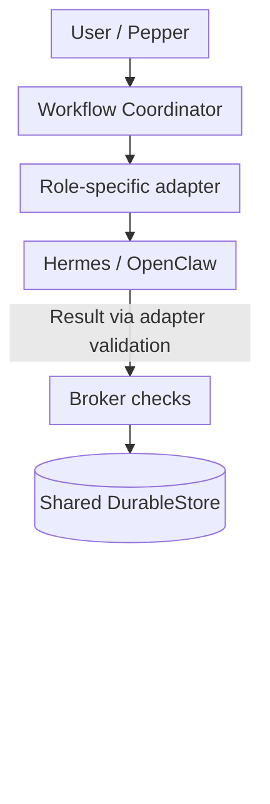
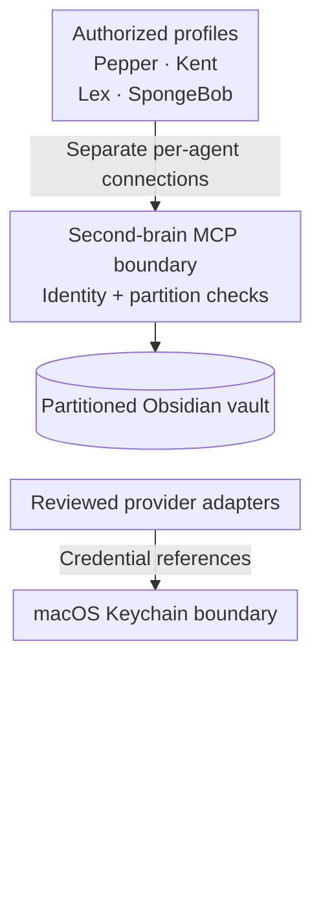
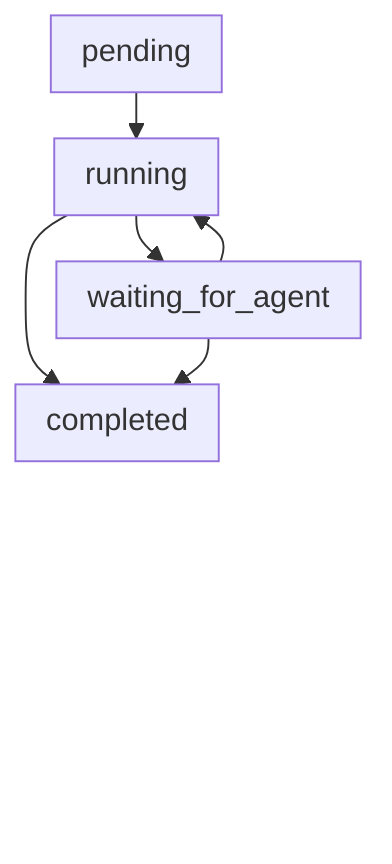
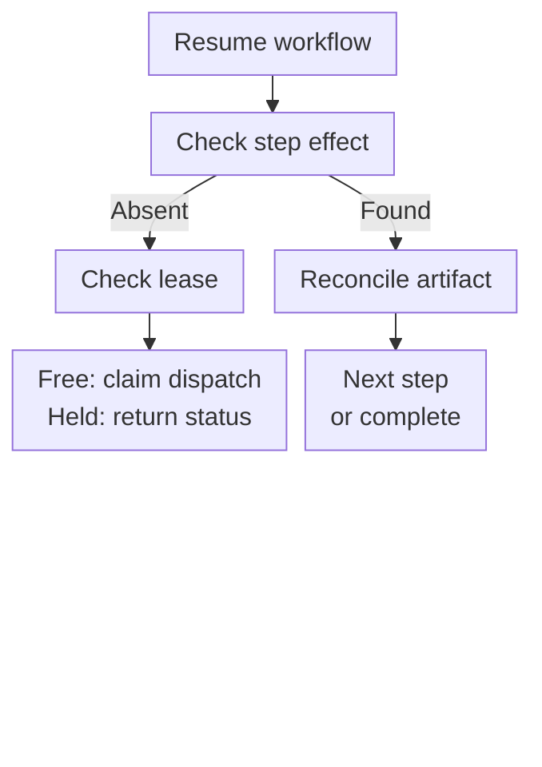

# Architecture

## Design principle

AI Workforce separates **probabilistic execution** from **deterministic authority**. Hermes and OpenClaw can run model/tool loops, but they do not decide what data may cross a boundary, whether an artifact is accepted, whether money may be spent, or whether an external action may occur.

### Execution and control plane

The coordinator calls the adapter; the adapter invokes the agent harness, validates its response, and submits the artifact to the Broker. The Broker authorizes and validates persistence, records lineage, and enforces replay bindings. Spend and approval checks precede supervised advancement. Jev supplies advisory classifications only.

### Data, credential and memory boundaries

Hermes profiles for Pepper, Lex, and SpongeBob and Kent's OpenClaw profile each bind their own identity at the MCP boundary. The MCP service checks that identity and permitted partitions on access; vault traffic does not pass through the Broker. The credential route is a separate boundary, not a vault capability. Profiles may expose memory tools while a particular fixed dispatch further restricts their use.

## Control-plane responsibilities

### Workflow Coordinator

The coordinator is deliberately adjacent to—not embedded inside—the Broker. It owns:

- versioned workflow runs and step state;
- append-only transition events;
- leases and bounded timeouts;
- durable dispatch records and attempt counts;
- status, resume, and cancellation semantics;
- recovery after an ambiguous response.

The coordinator and Broker share one `DurableStore`, allowing workflow transitions and authoritative artifact effects to be reconciled without a second database.

### Broker

The Broker remains the authority for:

- sender, recipient, purpose, and schema bindings;
- public, internal, private, and restricted data classes;
- schema validation and payload minimization;
- budgets and approvals;
- artifact persistence, hashes, lineage, and replay;
- denial of unmatched or unauthorized routes.

Agents exchange references to committed artifacts instead of sharing unrestricted conversational context.

### Model and harness boundary

Each role receives only the tools and data required by its contract. Harness configuration narrows tool catalogs and execution limits, while the Broker independently checks persisted cross-agent artifacts and workflow effects. Interactive harness chat responses do not universally pass through it. This is defense in depth: a permissive prompt or model mistake cannot create authority the deterministic layer does not grant.

## Durable workflow semantics

Three fixed workflows are implemented:

1. `pepper-kent-research-v1`
2. `pepper-kent-lex-article-v1`
3. `pepper-kent-spongebob-opportunity-v1`

The primary lifecycle below shows dispatch claims (`pending` → `running`), successful completion, and ambiguous results. Recovery either claims a retry or next step (`running`), or reconciles the final committed result (`completed`). `waiting_for_agent` means an ambiguous result, not a mandatory state for every dispatch.

| Terminal transition | Implemented behavior |
| --- | --- |
| `running` → `failed` | A dispatch exception fails the run and releases its reserved budget |
| `pending`, `running`, or `waiting_for_agent` → `cancelled` | Cancellation stops future steps and preserves committed artifacts and audit history |
| `completed`, `failed`, `cancelled` | Terminal; normal resume does not restart dispatch |

`waiting_for_approval` is **schema-reserved**, not an implemented coordinator waiting state. Approval thresholds are evaluated before supervised advancement; a denied advance does not persist that reserved state. Lease expiry permits recovery; it is not itself an automatic transition to `failed`.

Recovery is a separate decision, performed before another dispatch:

Execution is **at least once**. The caller supplies a durable `workflow_id`; identical requests under the same definition/version and ID resolve to the existing run, while conflicting reuse is rejected. Internal dispatch effects use step-specific idempotency keys. Recovery checks committed Broker effects before retry and does not promise exactly-once harness execution.

## Scheduling and external actions

One fixed, reviewed **08:00 Asia/Kolkata Kent briefing** schedule is enabled. It invokes `pepper-kent-research-v1` through a fixed wrapper and provides bounded Telegram delivery and local HTML output. Completed same-day work can be replayed without another Kent dispatch. Free-form or agent-created unattended scheduling remains out of scope.

External actions use selected reviewed adapters governed by deterministic policy and explicit human approval. The Broker is not a universal external-action executor. The briefing's pre-reviewed delivery is a bounded exception; unsupported connectors and consequential external writes remain denied, and publishing, applications, and purchases remain disabled or human-controlled.

## Data flow and privacy

The system uses four data classes:

| Class | Treatment |
| --- | --- |
| Public | May enter explicitly approved public model routes |
| Internal | Shared only across allowed local agent routes |
| Private | Local-only unless a narrowly redacted projection is explicitly approved |
| Restricted | Excluded from model context; quarantined or redacted |

The second brain follows the same boundary. Raw chat imports and personal source material stay in operator-only folders. Agents can create source-backed working notes or proposals in assigned partitions, but cannot silently promote those notes into authoritative user facts.

Jev observability follows a separate privacy-preserving path: inputs are represented by locally salted HMAC-SHA-256 digests, while predictions and later human labels are append-only events. Raw prompts, URLs, credentials, and personal content are not written to that ledger.

## Deployment boundary

The private system runs locally on macOS and uses:

- a Python 3.12 runtime for the control plane;
- Hermes and OpenClaw for role-specific model/tool loops;
- macOS Keychain for credential references;
- a launchd-managed signer process under a dedicated local account;
- an Obsidian vault for local knowledge;
- explicitly pinned provider/model routes when cloud inference is allowed.

The public showcase does not include deployment secrets, launchd state, browser profiles, session histories, private vault data, or third-party harness source.
