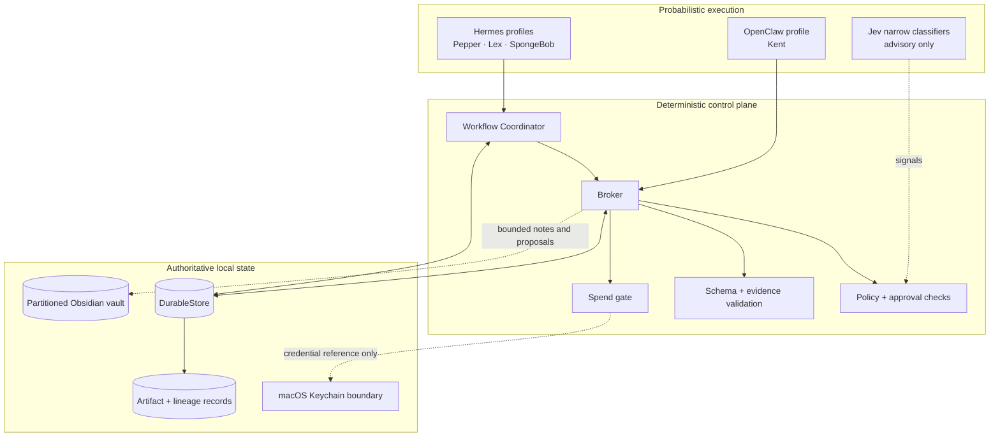
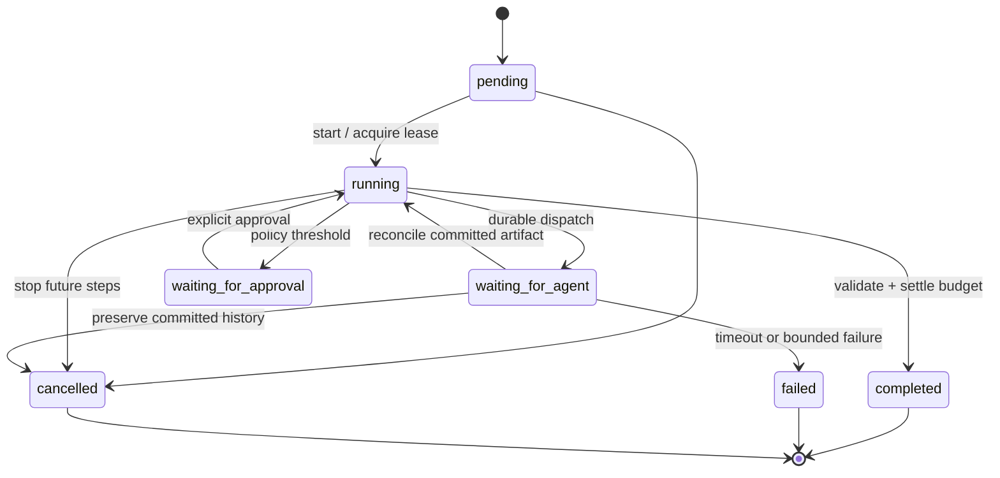

# Architecture

## Design principle

AI Workforce separates **probabilistic execution** from **deterministic authority**. Hermes and OpenClaw can run model/tool loops, but they do not decide what data may cross a boundary, whether an artifact is accepted, whether money may be spent, or whether an external action may occur.

## Control-plane responsibilities

### Workflow Coordinator

The coordinator is deliberately adjacent to—not embedded inside—the Broker. It owns:

- versioned workflow runs and step state;
- append-only transition events;
- leases and bounded timeouts;
- durable dispatch records and attempt counts;
- status, resume, and cancellation semantics;
- recovery after an ambiguous response.

The coordinator and Broker share one `DurableStore`, allowing workflow transitions and authoritative artifact effects to be reconciled without a second database.

### Broker

The Broker remains the authority for:

- sender, recipient, purpose, and schema bindings;
- public, internal, private, and restricted data classes;
- schema validation and payload minimization;
- budgets and approvals;
- artifact persistence, hashes, lineage, and replay;
- denial of unmatched or unauthorized routes.

Agents exchange references to committed artifacts instead of sharing unrestricted conversational context.

### Model and harness boundary

Each role receives only the tools and data required by its contract. Harness configuration narrows tool catalogs and execution limits, while the Broker independently re-checks meaningful effects. This is defense in depth: a permissive prompt or model mistake cannot create authority the deterministic layer does not grant.

## Durable workflow semantics

Three fixed workflows are implemented:

1. `pepper-kent-research-v1`
2. `pepper-kent-lex-article-v1`
3. `pepper-kent-spongebob-opportunity-v1`

Execution is **at least once**. Idempotency keys make Broker effects safe to replay, and recovery checks the authoritative artifact store before another dispatch. Cancellation prevents future steps but never deletes committed artifacts or audit history.

## Data flow and privacy

The system uses four data classes:

| Class | Treatment |
| --- | --- |
| Public | May enter explicitly approved public model routes |
| Internal | Shared only across allowed local agent routes |
| Private | Local-only unless a narrowly redacted projection is explicitly approved |
| Restricted | Excluded from model context; quarantined or redacted |

The second brain follows the same boundary. Raw chat imports and personal source material stay in operator-only folders. Agents can create source-backed working notes or proposals in assigned partitions, but cannot silently promote those notes into authoritative user facts.

Jev observability follows a separate privacy-preserving path: inputs are represented by locally salted HMAC-SHA-256 digests, while predictions and later human labels are append-only events. Raw prompts, URLs, credentials, and personal content are not written to that ledger.

## Deployment boundary

The private system runs locally on macOS and uses:

- a Python 3.12 runtime for the control plane;
- Hermes and OpenClaw for role-specific model/tool loops;
- macOS Keychain for credential references;
- a launchd-managed signer process under a dedicated local account;
- an Obsidian vault for local knowledge;
- explicitly pinned provider/model routes when cloud inference is allowed.

The public showcase does not include deployment secrets, launchd state, browser profiles, session histories, private vault data, or third-party harness source.
