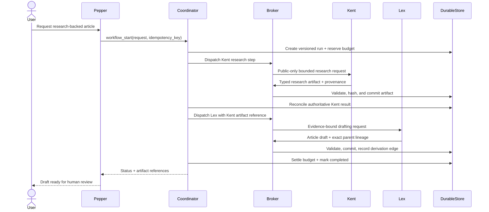

# Workflow walkthrough

This walkthrough uses the fixed **Kent → Lex article** workflow because it demonstrates coordination, evidence handling, durability, and editorial separation without requiring an external write.

## User goal

> Research a public technical topic and prepare a source-grounded article draft for my review.

## Execution



### 1. Validate and bind the request

Pepper can initiate only the named, versioned workflow. The coordinator validates the request shape, creates a durable workflow ID, and records the definition version. A repeated start with the same idempotency key returns the same run.

### 2. Reserve a bounded budget

The deterministic spend gate checks configured per-task and daily limits before a paid route can execute. Provider-reported usage is required for settlement. Exceeding a hard limit is a denial, not a model suggestion.

### 3. Dispatch Kent

Kent receives a public-only research request with bounded tools and execution time. Search snippets are leads, not evidence. Claims must retain source references and uncertainty; unknowns remain explicit.

### 4. Persist before continuing

The Broker validates Kent's schema and route, commits the research artifact, and records its content hash. The coordinator advances only after reconciling the authoritative committed effect.

If the harness disconnects after commit, the run may temporarily remain `waiting_for_agent`. Resume checks the Broker's artifact record first and continues without issuing a second effect.

### 5. Dispatch Lex with evidence—not an open chat transcript

Lex receives the accepted Kent artifact reference and only the data required for drafting. Lex cannot browse, publish, schedule, or switch models in this workflow. Factual claims in the draft must resolve to the supplied research evidence.

### 6. Record exact lineage

The draft is committed as a new artifact with the Kent research hash as its parent. A derivation edge records the relationship. Identical replay returns the existing artifact instead of silently creating a divergent copy.

### 7. Return to the user

The workflow ends with a draft for human review. It does not publish the article. In the accepted bounded run, Kent and Lex each had one dispatch attempt and the resulting draft contained 2,270 characters with exact lineage.

## Reliability example

Run the standalone simulator to see the ambiguous-commit path:

```bash
python3 examples/workflow_recovery_demo.py
```

The Broker commits a synthetic artifact and then simulates a lost acknowledgement. Resume finds that committed effect before retry, producing a completed run with one dispatch attempt.

## What this does not demonstrate

- arbitrary or user-authored workflow graphs;
- unattended or scheduled external action;
- production-scale throughput or multi-host failover;
- autonomous publishing;
- factual correctness beyond the supplied evidence contract.
