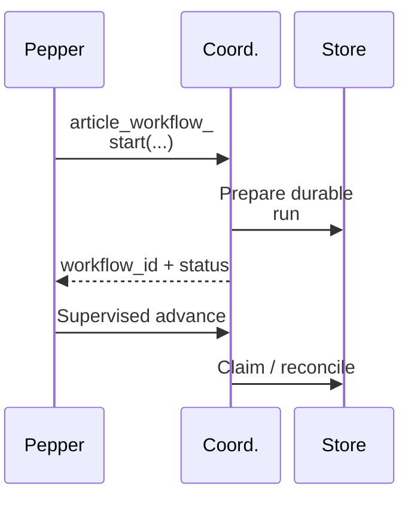
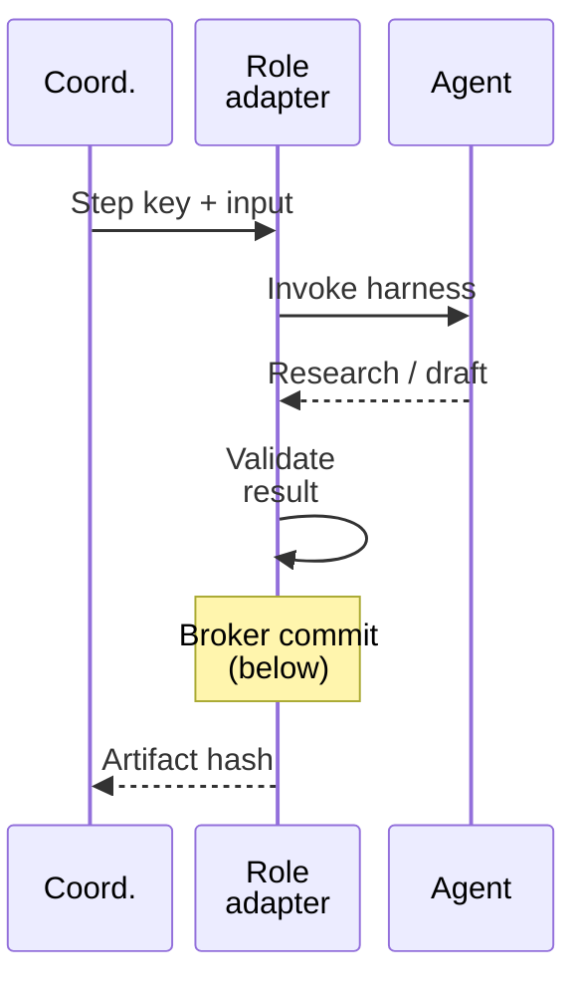
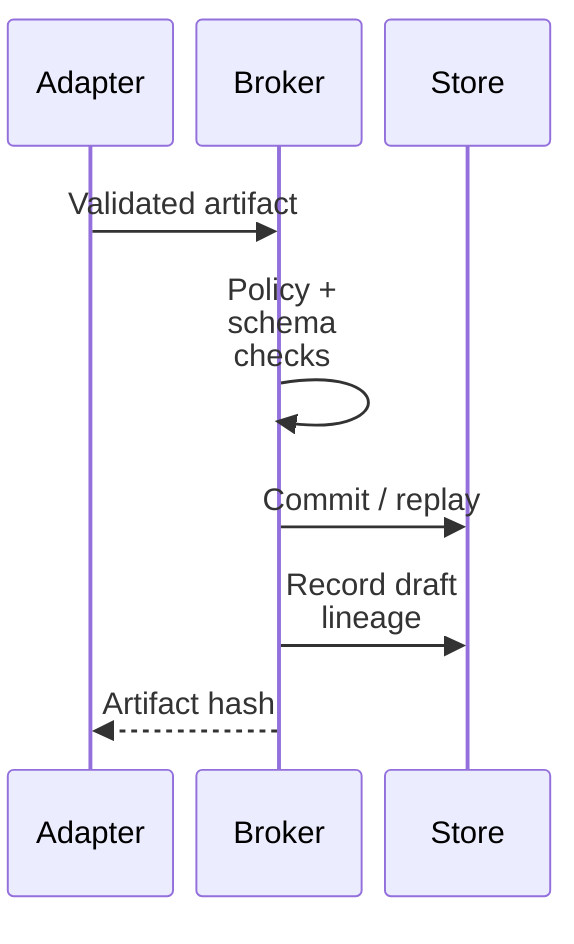

# Workflow walkthrough

This walkthrough uses the fixed **Kent → Lex article** workflow because it demonstrates coordination, evidence handling, durability, and editorial separation without requiring an external write.

## User goal

> Research a public technical topic and prepare a source-grounded article draft for my review.

## Execution

The diagrams separate control, dispatch, and commitment. “Coord.” denotes the Workflow Coordinator.



For each role, the coordinator invokes its adapter. Kent runs first; Lex is dispatched only after the accepted Kent artifact has been reconciled.



Kent uses OpenClaw; Lex uses Hermes. The adapter's commit happens before it returns the hash to the coordinator:



The lineage message applies to the Lex draft. After both accepted artifacts are reconciled, the coordinator settles the workflow budget, marks the run complete, and returns artifact references for human review.

### 1. Validate and bind the request

Pepper can initiate only the named, versioned workflow. The caller supplies a durable `workflow_id` to the public operation:

```text
article_workflow_start(
    workflow_id, objective, research_questions,
    freshness_requirement, article_brief
)
```

The coordinator validates the request and prepares the versioned run; start does not itself dispatch. Repeating the same `workflow_id` with an identical request resolves to the existing run. Conflicting reuse is rejected. Internal dispatch effects use separate step-specific idempotency keys; those are not a caller-supplied start argument.

### 2. Reserve a bounded budget

The deterministic spend gate checks configured per-task and daily limits before a paid route can execute. The fixed coordinator reserves a two-dispatch budget and settles the dispatch count; it does not reconcile provider-reported monetary usage. Exceeding a hard limit is a denial, not a model suggestion.

### 3. Dispatch Kent

Kent receives a public-only research request with bounded tools and execution time. Search snippets are leads, not evidence. Claims must retain source references and uncertainty; unknowns remain explicit.

### 4. Persist before continuing

The Broker validates Kent's schema and route, commits the research artifact, and records its content hash. The coordinator advances only after reconciling the authoritative committed effect.

If the harness disconnects after commit, the run may temporarily remain `waiting_for_agent`. Resume checks the Broker's artifact record first and continues without issuing a second effect.

### 5. Dispatch Lex with evidence—not an open chat transcript

Lex receives the accepted Kent artifact reference and only the data required for drafting. Lex cannot browse, publish, schedule, or switch models in this workflow. The fixed workflow constrains Lex to the accepted Kent research artifact and records exact artifact-level lineage. Claim-level verification requires the separate editorial-review path. Artifact acceptance does not deterministically verify every factual statement against a specific source.

### 6. Record exact lineage

The draft is committed as a new artifact with the Kent research hash as its parent. A derivation edge records the relationship. Identical replay returns the existing artifact instead of silently creating a divergent copy.

### 7. Return to the user

The workflow ends with a draft for human review. It does not publish the article. In the accepted bounded run, Kent and Lex each had one dispatch attempt and the resulting draft contained 2,270 characters with exact lineage.

## Reliability example

Run the standalone simulator to see the ambiguous-commit path:

```bash
python3 examples/workflow_recovery_demo.py
```

The simulator collapses adapter execution and Broker commitment into one call; it does not model the production dispatch topology or public start API. It commits a synthetic artifact and then simulates a lost acknowledgement. Resume finds that committed effect before retry, producing a completed run with one dispatch attempt.

## What this does not demonstrate

- arbitrary or user-authored workflow graphs;
- free-form or agent-created unattended scheduling (the separate fixed Kent briefing has reviewed Telegram/HTML delivery);
- production-scale throughput or multi-host failover;
- autonomous publishing;
- factual correctness beyond the supplied evidence contract.
